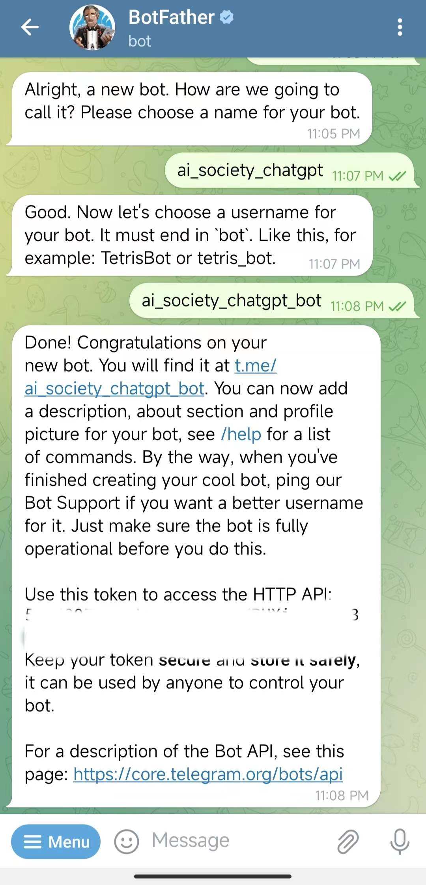
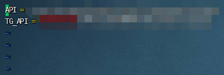
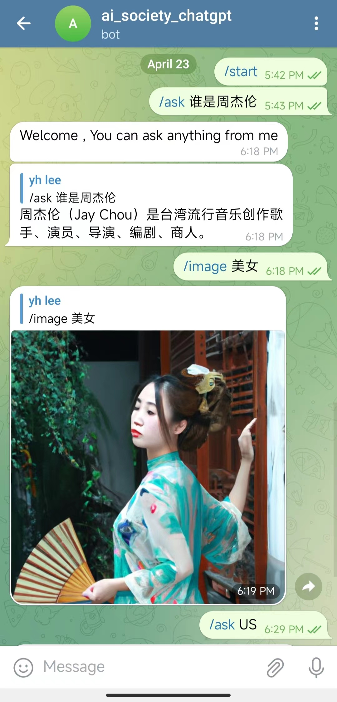

# ChatGPT接入Telegram 

> 前期准备：梯子、Telegram 、一台海外服务器、SSH工具，我这里使用[final shell](http://www.hostbuf.com/t/988.html)
>
> [视频教程](#7.参考：)

### 1.创建机器人

- 在Telegram 上搜索 **BotFather** 

- 再点击命令  **/newbot**  按照引导依次输入。

- 输入机器人用户名：ai_society_chatgpt_bot  （必须_bot结尾）


- 最后回复内容是机器人创建成功！**HTTP API:**后面的是该机器人的Token

  

### 2.安装软件

> 需要安装：node、git、pm2

##### 	1.更新软件包

> 这一步可以最开始做。
>
> 更新需要一点时间，请耐心等待。

- **Ubuntu和Debian**

  ```shell
  1.更新软件包缓存
  sudo apt update
  
  2.升级软件包
  sudo apt upgrade -y
  
  ```

- **CentOS和Red Hat** 

  ```shell
  1.更新软件包缓存
  sudo yum update
  
  2.确认更新
  命令运行后，yum 会列出将要更新的软件包和所需的磁盘空间。输入 y 并回车确认执行更新。
  
  ```

##### 	2.安装node命令：

> Node.js 是一个基于 Chrome V8 引擎的 JavaScript 运行环境，用于开发高性能的网络应用程序。它使用事件驱动、非阻塞 I/O 模型，可以处理大量并发连接，并支持快速构建可扩展的网络和 Web 应用程序。

- **Ubuntu和Debian**

  ```shell
  1.添加 Node.js PPA
  curl -fsSL https://deb.nodesource.com/setup_18.x | sudo -E bash -
  
  2.安装 Node.js
  sudo apt-get install -y nodejs
  
  3.验证 Node.js 是否安装成功
  node -v
  ```

- **CentOS和Red Hat** 

  ```shell
  1.添加 Node.js PPA
  curl -fsSL https://rpm.nodesource.com/setup_18.x | sudo bash -
  
  2.安装 Node.js 和 npm
  sudo yum install -y nodejs
  
  3.验证 Node.js 是否安装成功
  node -v
  ```

##### 	3.安装git

> Git 是一种分布式版本控制系统，用于管理和跟踪文件的修改历史。它可以记录每个文件的变更，包括谁对文件进行了何种修改以及何时进行的修改，并且支持多人协同开发和代码合并等功能，是现代软件开发中常用的工具之一。


- [或者不安装git](#3.下载机器人项目)

- **Ubuntu和Debian**

  ```shell
  1.安装 git
  sudo apt install git -y
  
  2.验证 git 是否安装成功
  git --version
  ```

  

- **CentOS和Red Hat** 

  ```shell
  1.安装 git
  sudo yum install git -y
  
  2.验证 git 是否安装成功
  git --version
  ```

##### 	4.安装pm2

> pm2 是一个 Node.js 进程管理工具，可以用于启动、停止、重载和监控 Node.js 应用程序。它还提供了日志记录、错误跟踪、负载均衡等功能，是部署和管理 Node.js 应用程序的常用工具之一。

- **Ubuntu/Debian/CentOS/Red Hat** 

  ```shell
  1.全局安装 pm2
  sudo npm install pm2 -g
  
  2.验证 pm2 是否安装成功
  pm2 --version
  
  如果输出了 pm2 的版本号，则说明 pm2 已经安装成功。
  注意：如果遇到权限问题，可以在命令前加上 sudo。
  ```


### 3.下载机器人项目

```shell

1.使用git命令，下拉项目或者不使用git 去下面地址手动下载项目并上传服务后解压
git clone https://github.com/harshitethic/chatgpt-bot-telegram.git

2.使用cd命令，进入文件夹
cd chatgpt-bot-telegram

3.使用npm命令，下载和安装所有依赖项
npm install

```


### 4.修改项目配置文件

> **注意：编辑文件的时候请注意 ，否则可能会造成编码出错**
>
> ​	API = 就是你在openAI官网上生成的apikey
>
> ​	TG_API = 就是telegram机器人生成的token
>
> 

```shell
这里使用vi演示，也可以用vim等其他的

1.使用vi命令打开.env文件
 vi .env
 
2.把API和TG_API Key复制上去

3.按下 Esc 键或者按 shift+: 确保已经回到命令模式

4.输入 :wq （w 表示写入，q 表示退出），然后按下回车键。
 wq
 
```


### 5.启动项目

> 启动执行下方的启动命令，就可以和机器人聊天了！


- 启动一个新的 Node.js 应用程序

  ```shell
  1.启动项目
  pm2 start index.js
  
  2.保存当前进程列表，以便在下次启动时自动恢复
  pm2 save
  
  3.设置开机自启动
  pm2 startup
  
  ```

- pm2相关命令

  ```shell
  pm2 start [filename]：启动 Node.js 应用程序并将其作为后台服务运行。
  pm2 stop [id]：停止指定 ID 的进程。
  pm2 restart [id]：重新启动指定 ID 的进程。
  pm2 delete [id]：删除指定 ID 的进程。
  pm2 list：显示当前正在运行的进程列表及其状态。
  pm2 monit：监视所有进程的 CPU 和内存使用情况。
  pm2 logs [id]：查看指定 ID 进程的日志。
  pm2 startup：设置 PM2 为系统启动时自动启动。
  pm2 save：保存当前进程列表，以便在下次启动时自动恢复。
  ```

  

### 6.在Telegram 上搜索取机器人用户名

> 可以单独私聊或者把机器人拉进群



### 7.参考：

[ChatGPT 接入到微信和Telegram 的完整教程！想怎么聊就怎么聊，太方便了！](https://www.youtube.com/watch?v=EfuTvNJFZbU&ab_channel=零度解说)

[把 ChatGPT 接入微信和 telegram（电报）就这么简单！)](https://www.freedidi.com/8417.html)